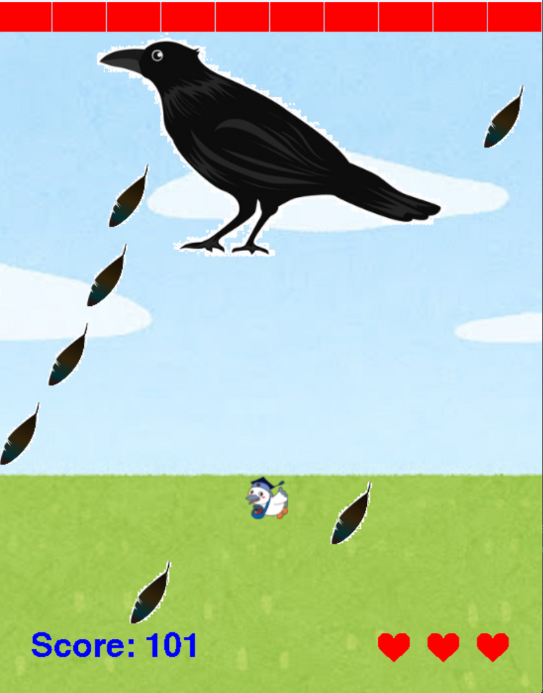

# 産め！こうかとん

## 実行環境の必要条件
* python >= 3.10
* pygame >= 2.1

## ゲームの概要
* こうかとんが左右に動きながら敵を倒すシューティングゲーム

## ゲームの遊び方
* 左右の矢印キーでこうかとんを操作し，スペースキー押下で卵を発射する
* 卵を発射していないときチャージが発動し、卵の色と威力が変わる
* ライフが０になるとゲームオーバー
* 敵を倒すとスコアを獲得し、100を超えるとボスが出現する
* ボスを倒すとゲームクリア

## ゲームの実装
### 共通基本機能
* 背景画像と主人公キャラクターの描画
* 卵の発射

### 分担追加機能
* チャージ攻撃（担当：中井）：卵を発射していないとき、一定時間ごとに卵の威力が上がっていく
* アイテム追加（担当：栩木）：獲得すると特殊な効果を発揮するアイテムの追加
* 雑魚敵追加（担当：川口）：敵を4種類設定、2種類がこうかとんに向かってくるhp1の鳥、もう2種類が風を飛ばしてくるhp3の鳥。敵の鳥がダメージを受けると赤くなる
* ボス追加（担当：門元）：条件達成時に現れるボスの追加とボスHPバーの描画
* 効果音追加（担当：齋藤）様々な効果音の追加

### ToDo
* ボスの種類の追加

### メモ
* サウンド関連のファイルはすべて Sound effects フォルダ内に配置しています。
=======
* チャージすることで卵が白色から銀色へ、銀色から金色へ変わるようにする

### メモ